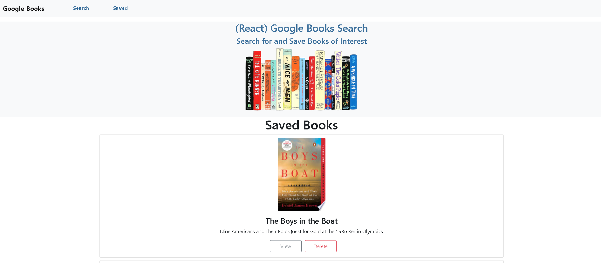

# Google_Books
Review and search books using MongoDB, Express, React, and Node

## Installation:
This project uses React, react-router-dom, Express, Axios, Node, MongoDB, Mongoose and Google Books API.  

## Usage:
Search books using the Google Books API, and save books to a database to retrieve later. View books to go to Google API book link. Delete books when they're no longer wanted in the database.

## Contributing:
This project is open to contributions.

## To Do:
* Make Save load data automatically, rather than requiring manual page refresh.
* Have Search return 10 results rather than one result. 

## License:
MIT License: A short and simple permissive license with conditions only requiring preservation of copyright and license notices. Licensed works, modifications, and larger works may be distributed under different terms and without source code. License descriptions provided by [Choose A License]https://choosealicense.com/)

## Questions:
* GitHub Username: lizlarkin
* lizlarkin GitHub Link
* Email me with addition questions at: enlarkin@gmail.com

## Link to the deployed page
:https://rocky-river-92841.herokuapp.com/Saved

## Screenshot: 

